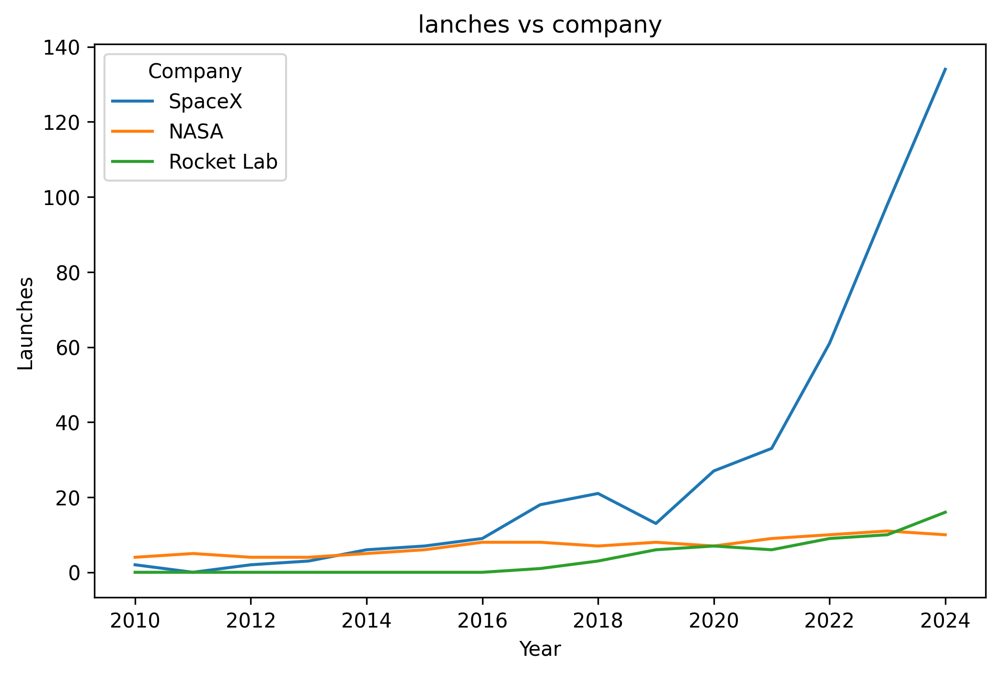
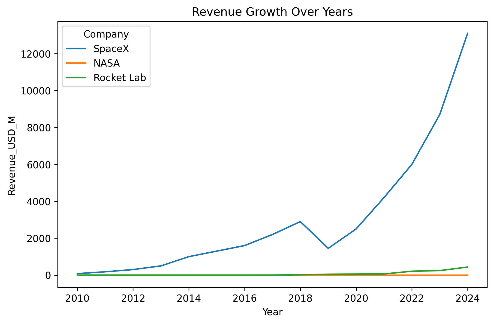
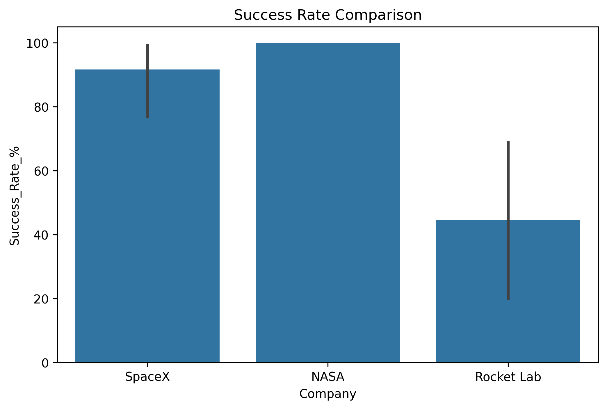
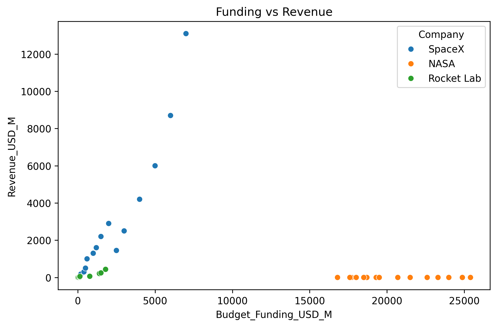
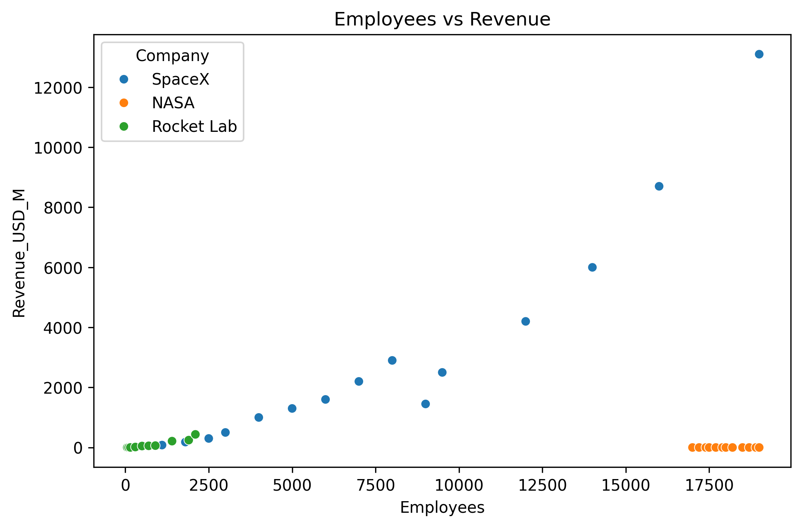
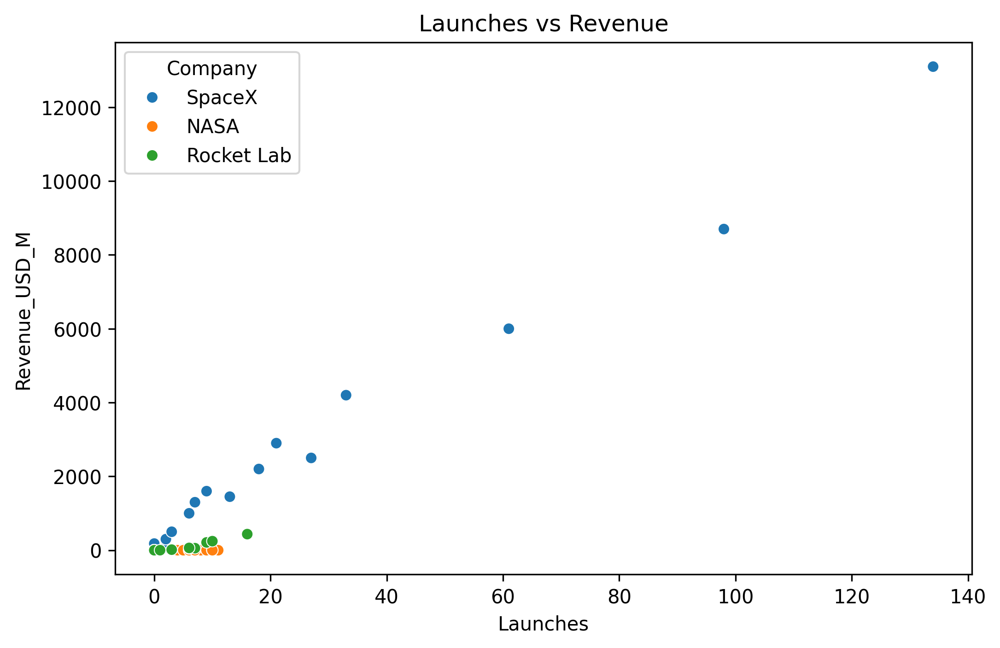
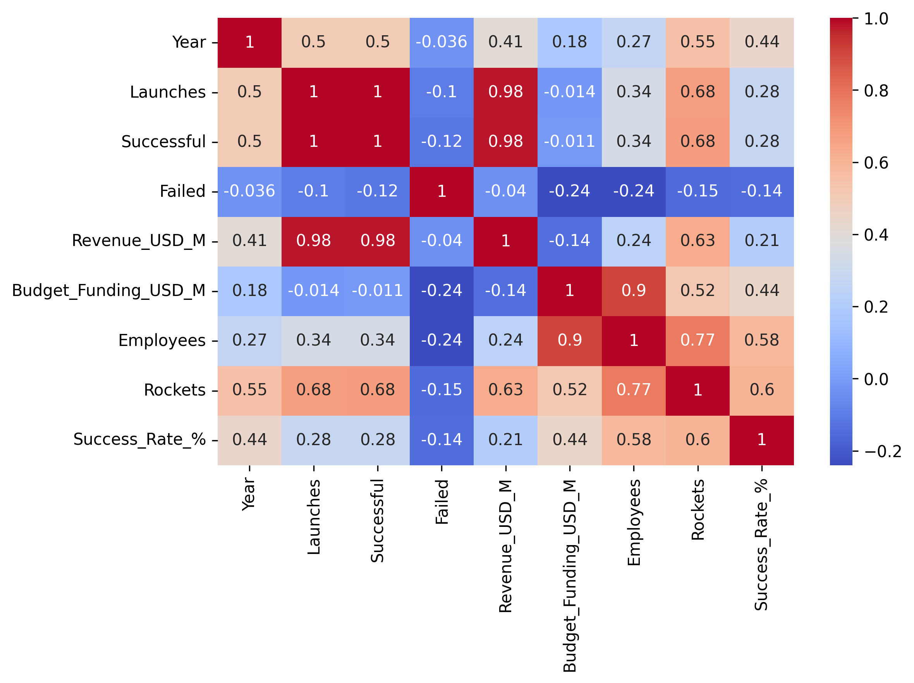
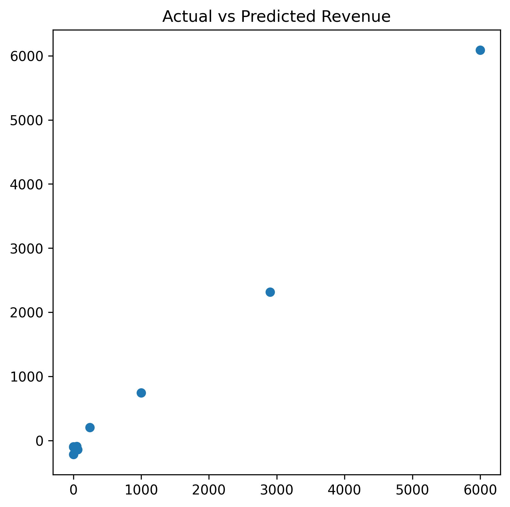

# 🚀 Space Industry Analytics (2010–2024)

A Machine Learning and Data Analysis project developed using **Python**, **Pandas**, **Matplotlib**, **Seaborn**, and **Scikit-learn**.

This project analyzes the performance of major space organizations from **2010 to 2024** and predicts **Revenue (USD Million)** using Machine Learning models.

---

# 📌 Project Overview

The main purpose of this project is to understand the growth of different space companies by analyzing launches, revenue, funding, employees, and mission success.

The project follows a complete Data Science workflow:

- Data Loading
- Data Understanding
- Data Cleaning
- Data Visualization
- Machine Learning
- Model Evaluation
- Model Comparison

---

# 🛠 Technologies Used

- Python
- NumPy
- Pandas
- Matplotlib
- Seaborn
- Scikit-learn
- VS Code

---

# 📂 Dataset Features

| Feature | Description |
|----------|-------------|
| Company | Organization Name |
| Year | Record Year |
| Launches | Total Launches |
| Successful | Successful Launches |
| Failed | Failed Launches |
| Revenue_USD_M | Revenue (Million USD) |
| Budget_Funding_USD_M | Budget/Funding |
| Employees | Total Employees |
| Rockets | Number of Rockets |
| Success_Rate_% | Mission Success Rate |

---

# 📊 Data Understanding

Before building any Machine Learning model, the dataset was explored using Pandas.

The following operations were performed:

- Dataset Information (`info()`)
- Data Types (`dtypes`)
- Statistical Summary (`describe()`)
- Dataset Shape
- Missing Values
- Duplicate Values

### Observation

- Dataset loaded successfully.
- No missing values were found.
- No duplicate records were present.
- Dataset was clean and ready for analysis.

---

# 📈 Data Visualization

## 1️⃣ Launches vs Company

This graph shows the yearly launch activity of each company.

### Observation

- SpaceX experienced rapid growth after 2017.
- NASA maintained stable launch activity.
- Rocket Lab gradually increased its launches.



---

## 2️⃣ Revenue Growth Over Years

This graph compares yearly revenue growth.

### Observation

- SpaceX showed exceptional revenue growth.
- Rocket Lab gradually increased its revenue.
- NASA recorded zero commercial revenue because it is government-funded.



---

## 3️⃣ Success Rate Comparison

This graph compares launch success rates.

### Observation

- NASA maintained an almost perfect success rate.
- SpaceX consistently achieved high success.
- Rocket Lab improved significantly over time.



---

## 4️⃣ Funding vs Revenue

This graph shows the relationship between funding and generated revenue.

### Observation

Organizations with higher funding generally generated higher revenue.



---

## 5️⃣ Employees vs Revenue

This graph analyzes how company size affects revenue.

### Observation

Revenue generally increased with the number of employees.



---

## 6️⃣ Launches vs Revenue

This graph compares launches with revenue.

### Observation

Companies performing more launches generally generated higher revenue.



---

## 7️⃣ Correlation Heatmap

The heatmap shows the relationship between numerical variables.

### Observation

Strong positive correlation was observed between:

- Revenue
- Launches
- Budget Funding
- Employees



---

# 🤖 Machine Learning

After completing Exploratory Data Analysis, Machine Learning models were developed.

## Data Preprocessing

The following preprocessing techniques were applied:

- Label Encoding
- Feature Selection
- Train-Test Split (80% Training, 20% Testing)

---

## Target Variable

Revenue_USD_M

---

## Input Features

- Company
- Year
- Launches
- Successful
- Failed
- Budget Funding
- Employees
- Rockets
- Success Rate

---

# 📈 Machine Learning Models

## Linear Regression

Linear Regression was used as the baseline model for predicting company revenue.

### Evaluation

- Mean Absolute Error (MAE)
- R² Score

---

## Random Forest Regressor

Random Forest Regressor was used to capture more complex relationships between variables.

### Evaluation

- Mean Absolute Error (MAE)
- R² Score

---

# 📊 Model Comparison

Both models were compared using MAE and R² Score.

The model with:

- Higher R² Score
- Lower MAE

was considered the best-performing model.

In this project, **Linear Regression produced better results** than Random Forest because the dataset is relatively small and follows a mostly linear relationship.

---

# 📉 Actual vs Predicted Revenue

This graph compares the actual revenue values with the predicted revenue values generated by the Linear Regression model.

### Observation

Most predicted values are close to the actual revenue values, indicating that the model performs well.



---

# 📁 Project Structure

```
Final Assement/
│
├── images/
│   ├── launches_vs_company.png
│   ├── revenue_growth.png
│   ├── success_rate.png
│   ├── funding_vs_revenue.png
│   ├── employees_vs_revenue.png
│   ├── launches_vs_revenue.png
│   ├── correlation_heatmap.png
│   └── actual_vs_predicted.png
│
├── train.py
├── README.md
├── requirements.txt
└── Space_Industry_Analytics_2010_2024.csv
```

---

# 🚀 Future Improvements

- Apply Feature Engineering
- Perform Hyperparameter Tuning
- Test additional Machine Learning algorithms
- Deploy the model using Streamlit
- Build an interactive dashboard

---

# 👨‍💻 Author

**Your Name**

BS Artificial Intelligence

Final Assessment Project

Python | Data Analysis | Machine Learning