<div align="center">

# 🚀 SpaceX Mission Analysis & Machine Learning Classification

### 📊 Exploratory Data Analysis | 🤖 Machine Learning | 📈 Data Visualization


<br>


</div>

---

# 🌌 Project Overview

This project performs an end-to-end Machine Learning pipeline using historical **SpaceX Launch Missions**.

The project covers:

✅ Data Understanding

✅ Data Cleaning

✅ Exploratory Data Analysis

✅ Feature Engineering

✅ Encoding

✅ Feature Selection

✅ Standard Scaling

✅ Machine Learning Classification

✅ Model Comparison

✅ Best Model Selection

---

# 📂 Dataset Information

The dataset contains historical SpaceX launch missions from **2006–2017**.

### Dataset Features

| Feature |
|---------|
| Flight Number |
| Launch Date |
| Launch Time |
| Launch Site |
| Vehicle Type |
| Payload Name |
| Payload Type |
| Payload Mass |
| Payload Orbit |
| Customer Name |
| Customer Type |
| Customer Country |
| Mission Outcome |
| Failure Reason |
| Landing Type |
| Landing Outcome |

---

# 🎯 Project Objective

The objective of this project is to predict whether a **SpaceX Mission** will be **Successful or Failed** using Machine Learning classification algorithms.

---

# 🛠 Technologies Used

- Python
- Pandas
- NumPy
- Matplotlib
- Seaborn
- Scikit-Learn

---

# ⚙ Project Workflow

```text
Dataset
   │
   ▼
Data Understanding
   │
   ▼
Data Cleaning
   │
   ▼
EDA
   │
   ▼
Feature Engineering
   │
   ▼
Encoding
   │
   ▼
Feature Selection
   │
   ▼
Train-Test Split
   │
   ▼
Standard Scaling
   │
   ▼
Machine Learning Models
   │
   ▼
Evaluation
   │
   ▼
Best Model Selection
```

---

# 📊 Exploratory Data Analysis

## 1️⃣ Mission Outcome Distribution

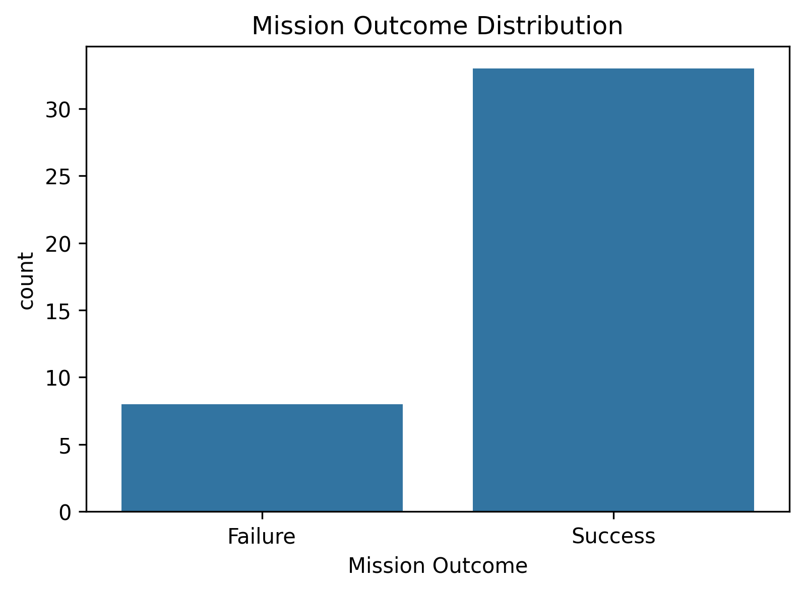

---
Shows the number of successful and failed SpaceX missions.

---

## 2️⃣ Launches Per Year

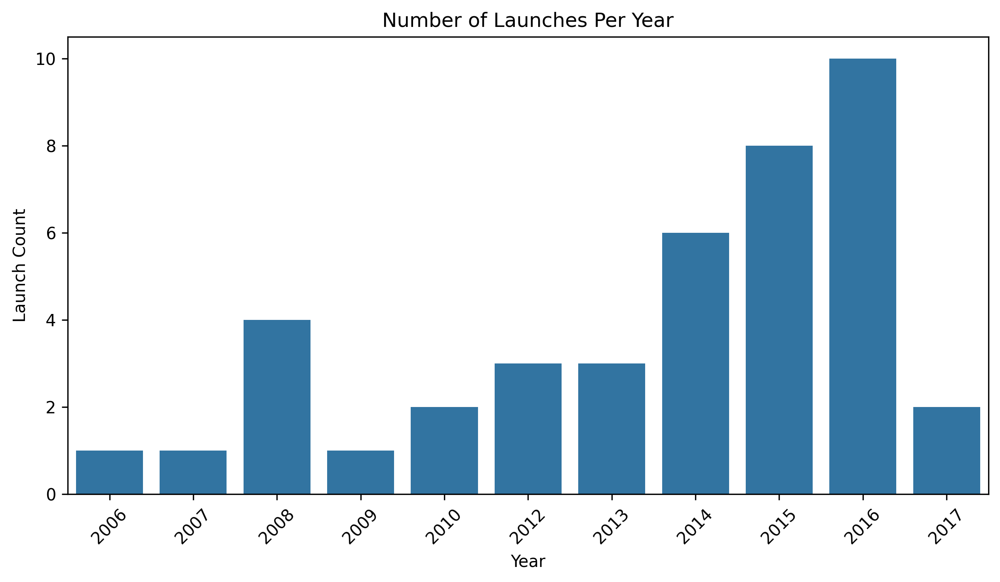
Illustrates the number of launches performed each year.

---

## 3️⃣ Payload Mass vs Launch Year

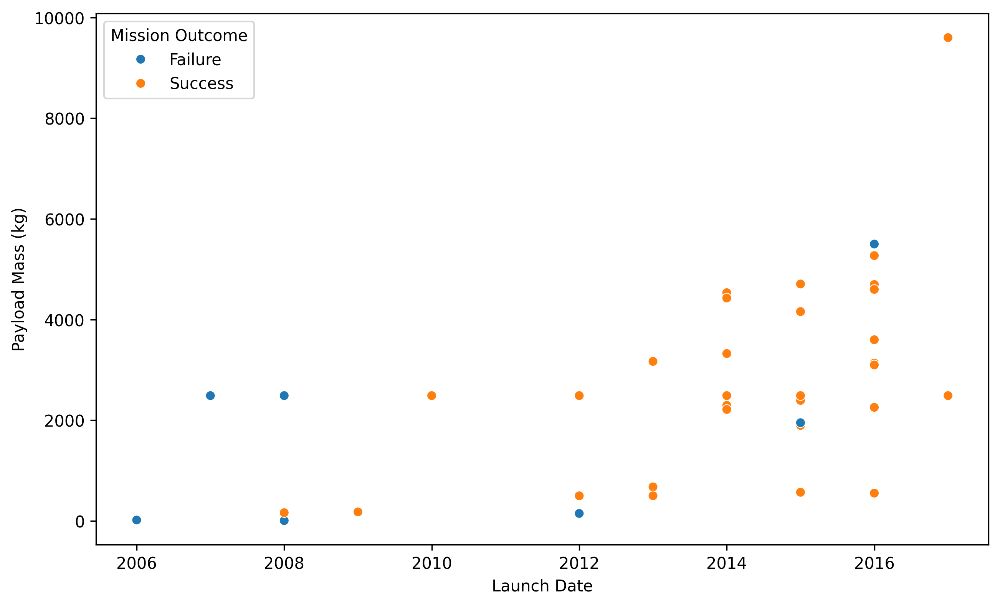

Shows how payload mass changed over time.

---

## 4️⃣ Vehicle Distribution

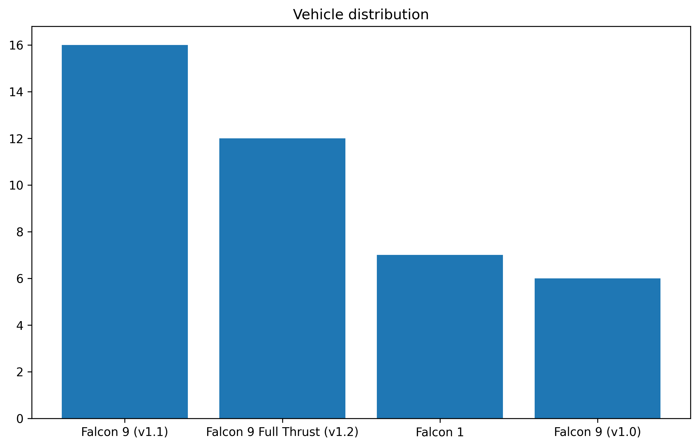

Displays the frequency of different Falcon vehicle variants.

---

## 5️⃣ Payload Type Distribution

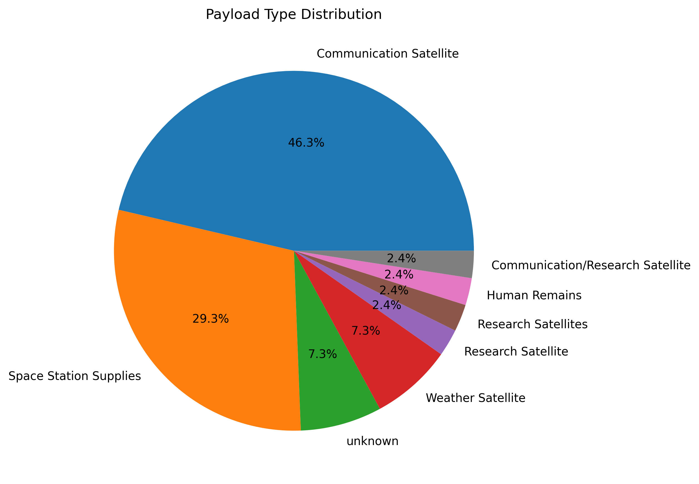


Represents different payload categories.

---

## 6️⃣ Payload Mass by Mission Outcome

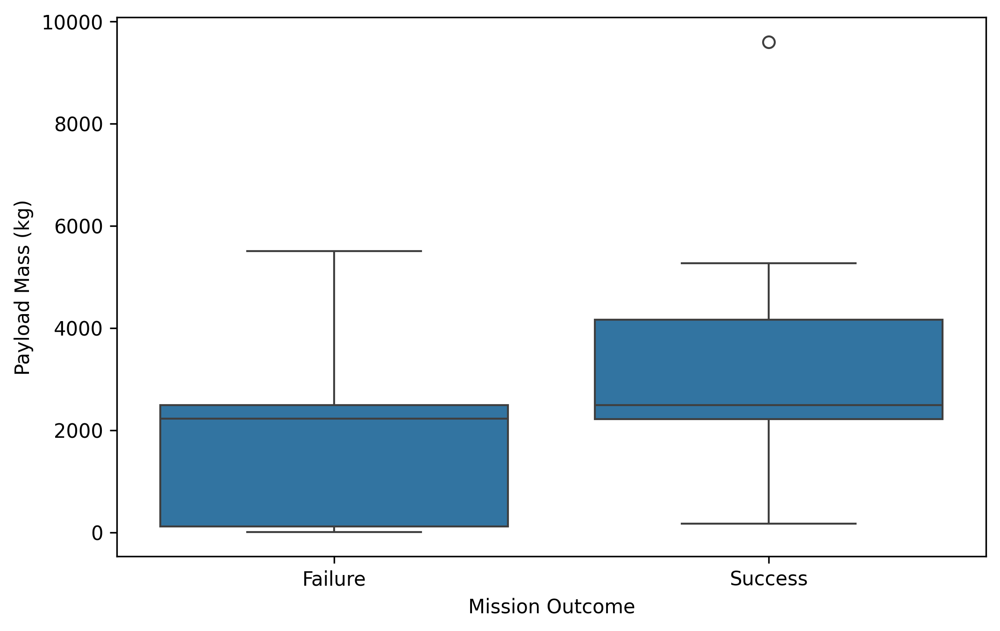

Compares payload mass for successful and failed missions.

---

## 7️⃣ KDE Plot

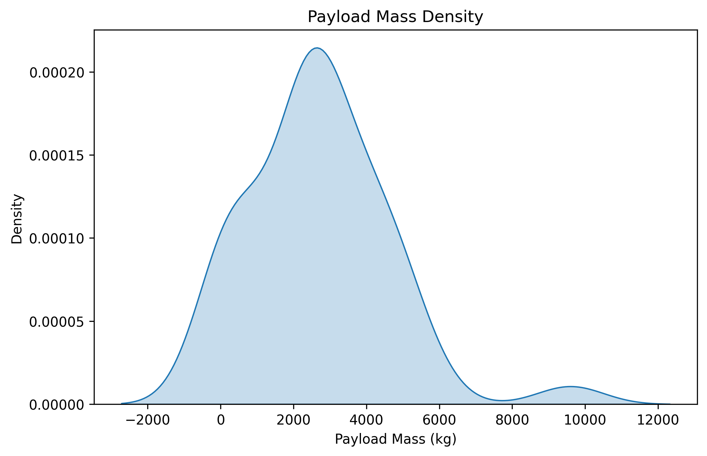

Shows the probability density distribution of payload mass.

---

## 8️⃣ Swarm Plot

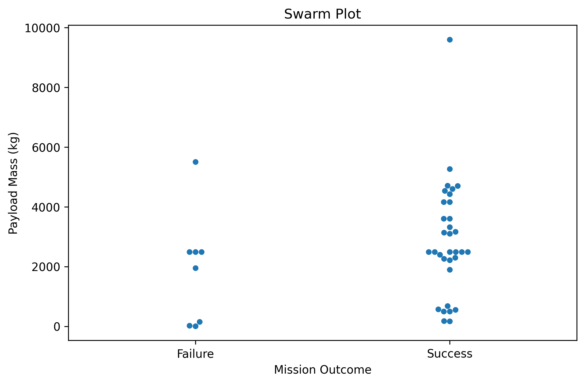

Displays every mission individually.

---

## 9️⃣ Violin Plot

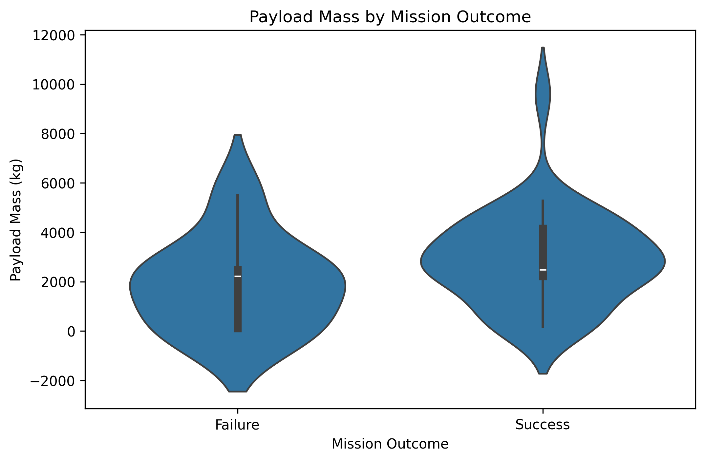
Combines Boxplot and KDE for payload mass.

---

## 🔟 Correlation Heatmap

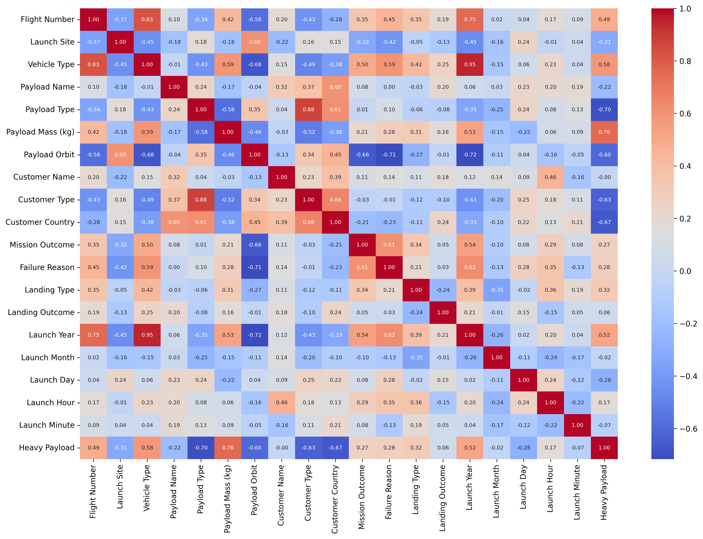

---
Shows correlations among numerical features.

---
### Model Accuracy Comparison

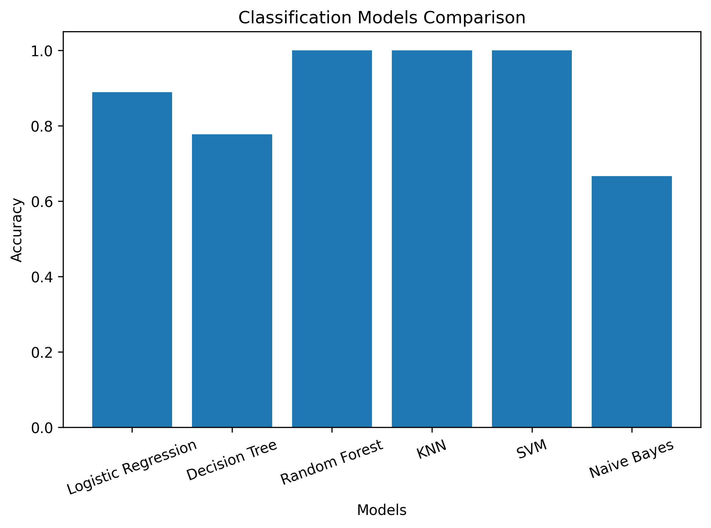

**Insight:** Random Forest, KNN, and SVM achieved the highest accuracy on the dataset.

---

### Feature Importance

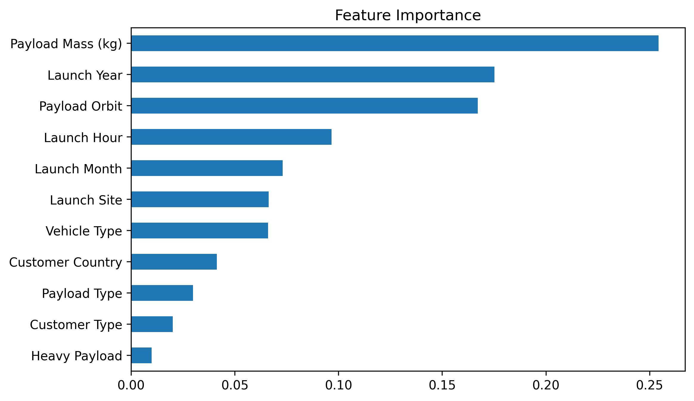

**Insight:** This graph shows which features contributed the most to predicting mission success.


# ⚙ Feature Engineering

The following features were created:

- Launch Year
- Launch Month
- Launch Day
- Launch Hour
- Launch Minute
- Heavy Payload Indicator

---

# 🔤 Data Encoding

Label Encoding was applied on categorical columns such as:

- Launch Site
- Vehicle Type
- Payload Type
- Customer Type
- Customer Country
- Mission Outcome

---

# 📌 Machine Learning Models

The following models were trained:

- Logistic Regression
- Decision Tree
- Random Forest
- K-Nearest Neighbors
- Support Vector Machine
- Gaussian Naive Bayes

---

# 📈 Evaluation Metrics

Each model was evaluated using:

- Accuracy
- Precision
- Recall
- F1 Score
- Confusion Matrix
- Classification Report

---

# 🏆 Model Comparison

| Model | Accuracy |
|--------|----------|
| Logistic Regression | 88.89% |
| Decision Tree | 77.78% |
| Random Forest | **100%** |
| KNN | **100%** |
| SVM | **100%** |
| Naive Bayes | 66.67% |

---

# 🥇 Best Model

🏆 **Random Forest Classifier**

Accuracy: **100%**

The Random Forest classifier achieved the highest overall performance on the test dataset.

---

# 📂 Project Structure

```text
SpaceX Mission 2006(Task2)

│

├── database.csv

├── TRAIN.py

├── README.md

│

├── images/

│      mission_outcome_distribution.png

│      launches_per_year.png

│      payload_mass_vs_launch_year.png

│      vehicle_distribution.png

│      payload_type_distribution.png

│      payload_mass_by_outcome.png

│      kde_plot.png

│      swarm_plot.png

│      violin_plot.png

│      correlation_heatmap.png

│      model_accuracy_comparison.png
```

---

# ▶ How To Run

```bash
pip install pandas numpy matplotlib seaborn scikit-learn
```

```bash
python TRAIN.py
```

---

# 📌 Conclusion

The project successfully demonstrates a complete Machine Learning workflow including data preprocessing, visualization, feature engineering, model training, evaluation, and comparison.

Random Forest, Support Vector Machine, and KNN achieved the highest classification accuracy of **100%** on the testing dataset.

---

# 🚀 Future Improvements

- Hyperparameter Tuning
- Cross Validation
- Grid Search CV
- XGBoost
- LightGBM
- CatBoost
- Streamlit Deployment
- FastAPI Deployment

---

<div align="center">

# ⭐ Thank You ⭐


### 💙 Made with Python & Machine Learning

</div>
