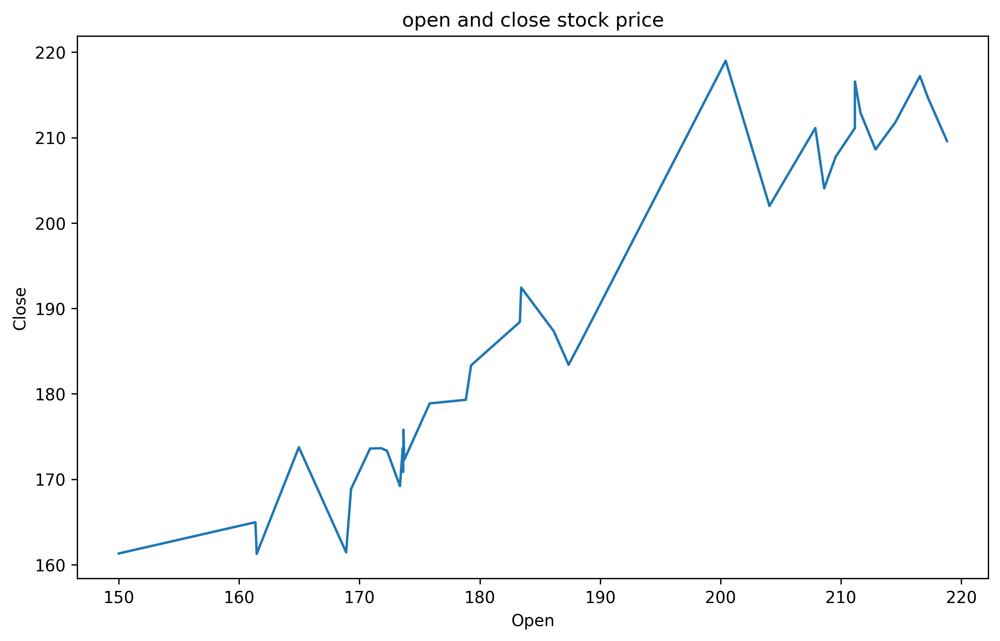
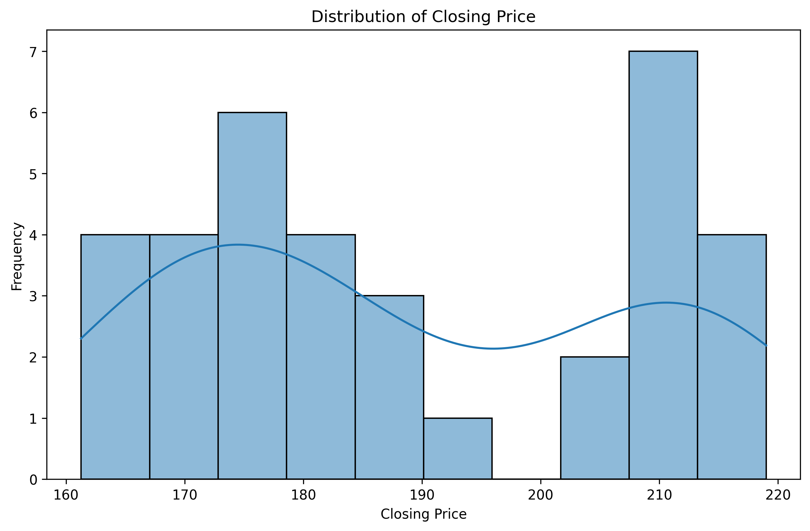
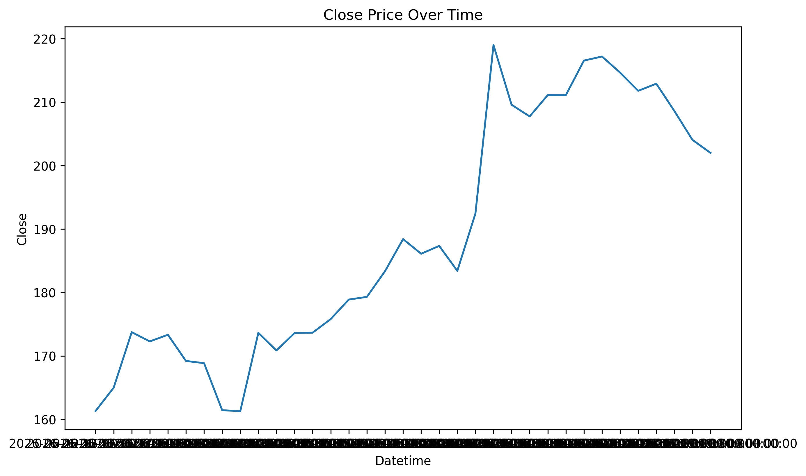
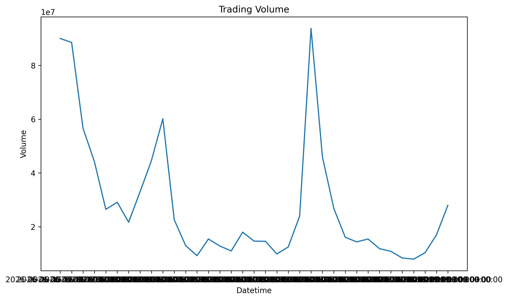
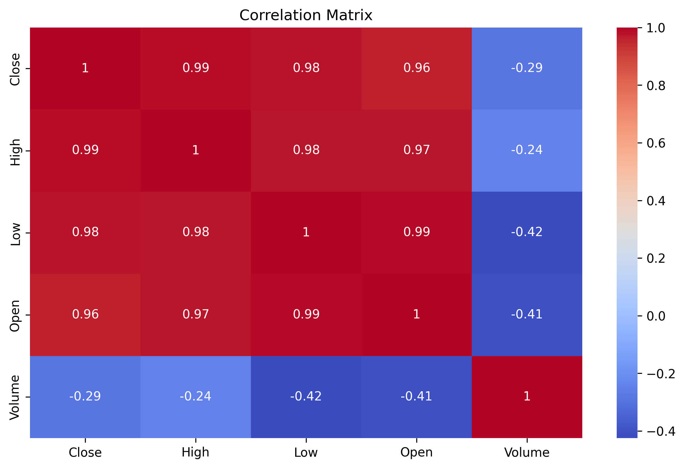
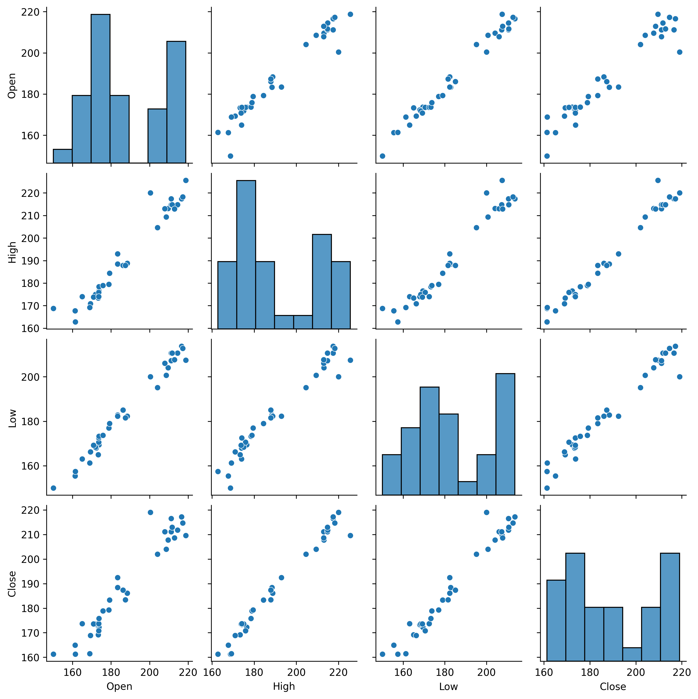
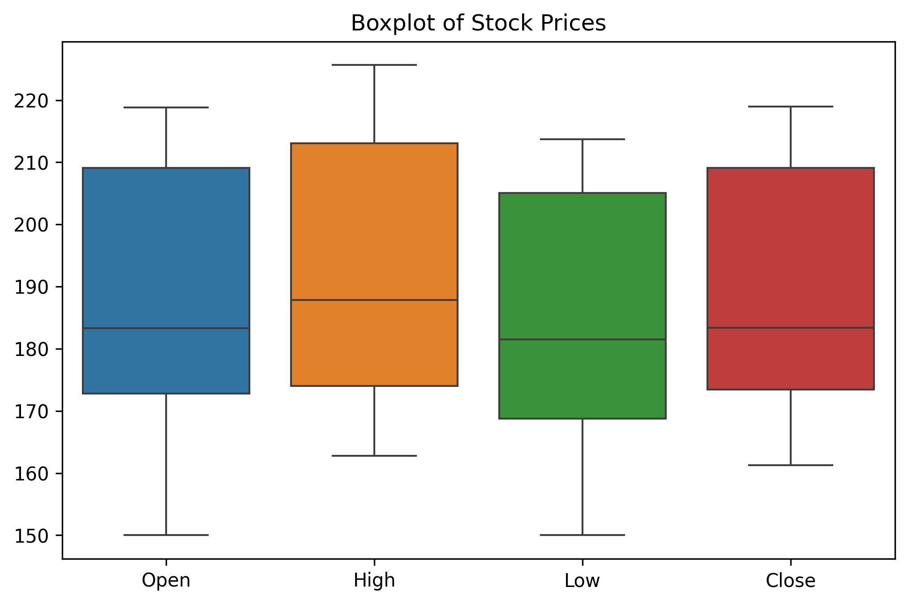
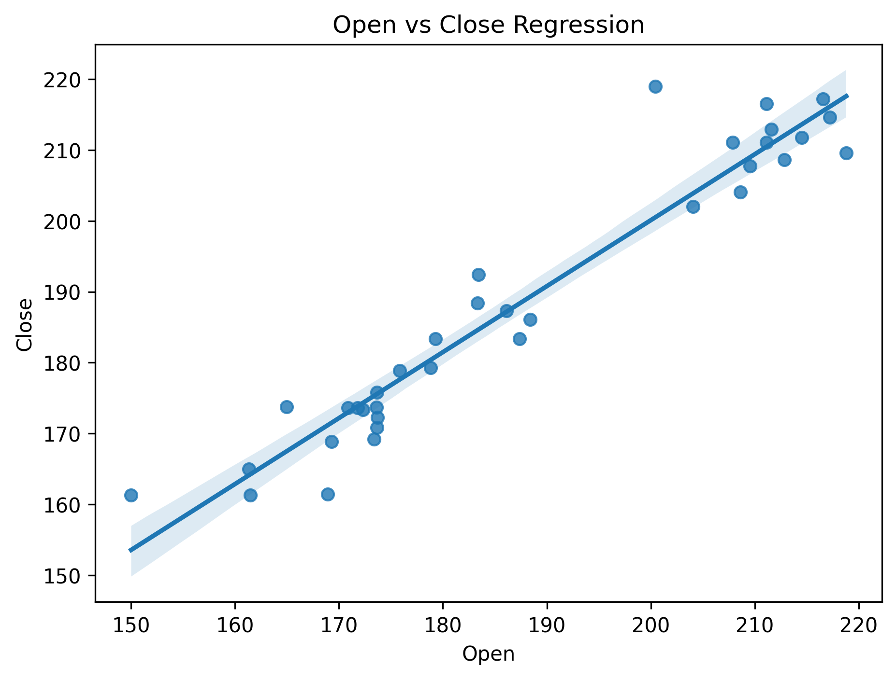
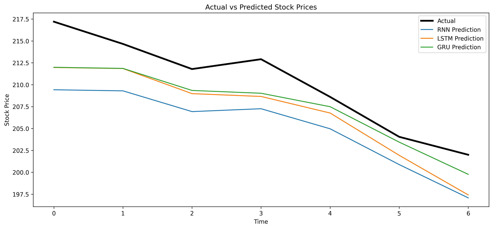
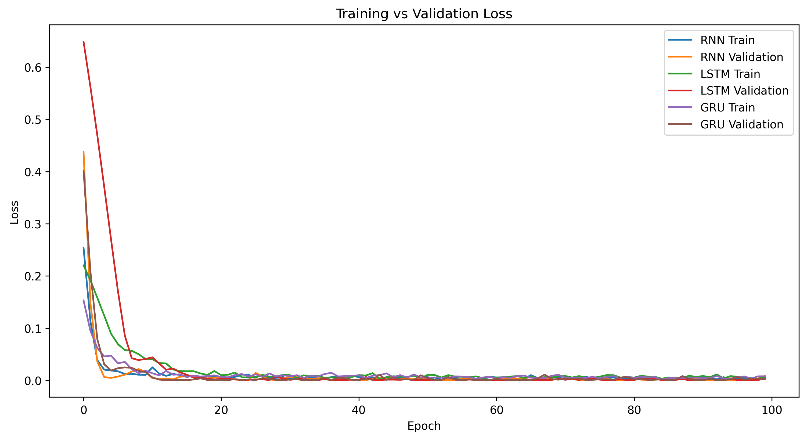

<div align="center">

# 🚀 SpaceX Stock Price Prediction using Deep Learning


<br>


---

<p align="center">


</p>

---

# 🌟 Project Overview

This project focuses on predicting **SpaceX stock closing prices** using **Deep Learning Time Series Forecasting** techniques.

Instead of using traditional Machine Learning algorithms, this project explores how Recurrent Neural Networks can learn historical stock market patterns and forecast future closing prices.

The project performs a complete machine learning pipeline from **data analysis** to **model comparison**.

---

# 🎯 Objectives

✔ Analyze historical SpaceX stock market data

✔ Perform Exploratory Data Analysis (EDA)

✔ Visualize important stock market trends

✔ Normalize and preprocess the dataset

✔ Train multiple Deep Learning models

✔ Compare model performance

✔ Select the best forecasting model automatically

---

# 📂 Dataset

The dataset contains historical SpaceX stock information.

| Feature  | Description            |
| -------- | ---------------------- |
| Datetime | Trading Date & Time    |
| Open     | Opening Price          |
| High     | Highest Price          |
| Low      | Lowest Price           |
| Close    | Closing Price (Target) |
| Volume   | Trading Volume         |

Target Variable

```text
Close Price
```

---

# 📊 Exploratory Data Analysis

The dataset was explored using Pandas and NumPy.

The following analysis was performed:

* Dataset Shape
* Data Types
* Statistical Summary
* Missing Values
* Duplicate Values
* Maximum Values
* Mean
* Median
* Variance
* Standard Deviation

---

# 📈 Data Visualization

## 1️⃣ Open vs Close Price

This graph compares opening and closing prices of SpaceX stock.

It helps understand price movement during trading sessions.

<p align="center">

</p>

---

## 2️⃣ Closing Price Distribution

Shows how frequently different closing prices occur.

Useful for understanding stock price distribution.

<p align="center">

</p>

---

## 3️⃣ Closing Price Trend

Shows how SpaceX stock prices changed over time.

Useful for identifying market trends.

<p align="center">

</p>

---

## 4️⃣ Trading Volume

Shows trading activity over time.

Higher volume usually indicates stronger market participation.

<p align="center">

</p>

---

## 5️⃣ Correlation Heatmap

Displays correlation between all numerical features.

Strong positive correlation indicates variables move together.

<p align="center">

</p>

---

## 6️⃣ Pair Plot

Visualizes relationships among Open, High, Low and Close prices.

Useful for identifying trends and feature relationships.

<p align="center">

</p>

---

## 7️⃣ Box Plot

Shows distribution and detects outliers in stock prices.

<p align="center">

</p>

---

## 8️⃣ Regression Plot

Illustrates the relationship between Open and Close prices.

<p align="center">

</p>

---

# ⚙ Data Preprocessing

The following preprocessing steps were performed:

* Datetime conversion
* Sorting data chronologically
* Setting Datetime as Index
* Feature Selection
* Min-Max Scaling
* Time Series Sequence Creation

Input Features

```
Open
High
Low
Volume
```

Target

```
Close
```

Sequence Length

```
10 Previous Timesteps
```

---

# 🤖 Deep Learning Models

## 🔹 Simple RNN

Architecture

```
SimpleRNN
↓

Dropout

↓

Dense

↓

Dense
```

### Advantages

* Simple architecture
* Fast training
* Good baseline model

---

## 🔹 LSTM

Architecture

```
LSTM

↓

Dropout

↓

LSTM

↓

Dropout

↓

Dense

↓

Dense
```

### Advantages

* Learns long-term dependencies
* Solves Vanishing Gradient problem
* Better sequence learning

---

## 🔹 GRU

Architecture

```
GRU

↓

Dropout

↓

GRU

↓

Dropout

↓

Dense

↓

Dense
```

### Advantages

* Faster than LSTM
* Requires fewer parameters
* Excellent prediction performance

---

# 📊 Model Evaluation

The models were evaluated using

* Mean Absolute Error (MAE)
* Mean Squared Error (MSE)
* R² Score

---

# 🏆 Model Comparison

| Model   | MAE       | MSE       | R² Score  |
| ------- | --------- | --------- | --------- |
| RNN     | 1.843     | 5.388     | 0.797     |
| LSTM    | 1.529     | 3.725     | 0.860     |
| **GRU** | **1.478** | **2.900** | **0.891** |

---

# 🥇 Best Performing Model

The **GRU model** achieved the highest prediction accuracy.

### Why GRU?

* Lowest MAE
* Lowest MSE
* Highest R² Score
* Faster training
* Fewer parameters than LSTM
* Better learning capability for this dataset

---

# 📉 Actual vs Predicted Prices

Comparison between actual stock prices and predictions generated by all three models.

<p align="center">

</p>

The GRU prediction follows the actual stock prices more closely than RNN and LSTM.

---

# 📉 Training vs Validation Loss

This graph compares how each model learned during training.

<p align="center">

</p>

A decreasing validation loss indicates better generalization and learning.

---

# 🛠 Technologies Used

* Python
* TensorFlow
* NumPy
* Pandas
* Matplotlib
* Seaborn
* Scikit-Learn

---

# 📁 Project Structure

```text
SpaceX-Stock-Price-Prediction/
│
├── images/
│   ├── open_close.png
│   ├── Distribution_of_Closing.png
│   ├── Close_PriceTime.png
│   ├── Trading_Volume.png
│   ├── Correlation_Heatmap.png
│   ├── pairplot.png
│   ├── Boxplot_of_Stock_Prices.png
│   ├── Open_vs_Close_Regression.png
│   ├── Actual_vs_PredictedStock.png
│   └── Training_vs_ValidationLoss.png
│
├── spacex.csv
├── stock_prediction.py
├── requirements.txt
└── README.md
```

---

# 🚀 Future Improvements

* Bidirectional LSTM
* CNN-LSTM Hybrid Model
* Hyperparameter Tuning
* Live Stock Prediction
* Streamlit Dashboard
* FastAPI Deployment
* Docker Support
* Cloud Deployment

---

# 📚 Learning Outcomes

Through this project I gained practical experience in:

* Exploratory Data Analysis
* Feature Engineering
* Data Visualization
* Time Series Forecasting
* Deep Learning
* TensorFlow
* RNN
* LSTM
* GRU
* Model Evaluation
* Stock Market Prediction

---

<div align="center">

## ⭐ If you like this project, don't forget to Star the repository.


### Made with ❤️ by Sana Shafique

</div>
