<div align="center">

# 🚀 SpaceX Launch Success Prediction using Deep Learning


<br>


---

### 🚀 Predicting SpaceX Rocket Launch Success using Recurrent Neural Networks

*"Exploring how Deep Learning models perform on real-world SpaceX launch data."*

</div>

---

# 📖 Project Overview

This project predicts whether a **SpaceX rocket launch will be successful or not** using Deep Learning techniques.

Three recurrent neural network architectures were implemented and compared:

- 🧠 Simple RNN
- 🧠 LSTM (Long Short-Term Memory)
- 🧠 GRU (Gated Recurrent Unit)

The project covers the complete Machine Learning workflow, including data preprocessing, visualization, model building, evaluation, and performance comparison.

---

# 🎯 Objectives

✅ Analyze SpaceX launch data

✅ Perform Data Cleaning & Feature Engineering

✅ Visualize important launch patterns

✅ Train multiple Deep Learning models

✅ Compare RNN, LSTM and GRU

✅ Evaluate model performance

---

# 📂 Dataset

**Dataset Name**

```
spacex_launches.csv
```

### Features

- 🚀 Rocket Name
- 📍 Launchpad
- 📅 Launch Date
- 🎯 Landing Type
- 🔄 Core Reuse
- 📦 Payload Information
- ✅ Mission Success

**Target Variable**

```
success
```

---

# 🛠️ Technologies Used

| Category | Tools |
|----------|-------|
| Language | Python |
| Deep Learning | TensorFlow / Keras |
| Data Processing | Pandas, NumPy |
| Machine Learning | Scikit-Learn |
| Visualization | Matplotlib, Seaborn |

---

# 🔄 Project Workflow

```text
SpaceX Dataset
      │
      ▼
Data Cleaning
      │
      ▼
Missing Value Handling
      │
      ▼
Label Encoding
      │
      ▼
Feature Scaling
      │
      ▼
Sequence Creation
      │
      ▼
Train/Test Split
      │
      ▼
RNN
LSTM
GRU
      │
      ▼
Prediction
      │
      ▼
Performance Comparison
```

---

# 📊 Exploratory Data Analysis

The following visualizations were created to better understand the dataset.

| Visualization | Screenshot |
|--------------|------------|
| Launch Success Distribution | 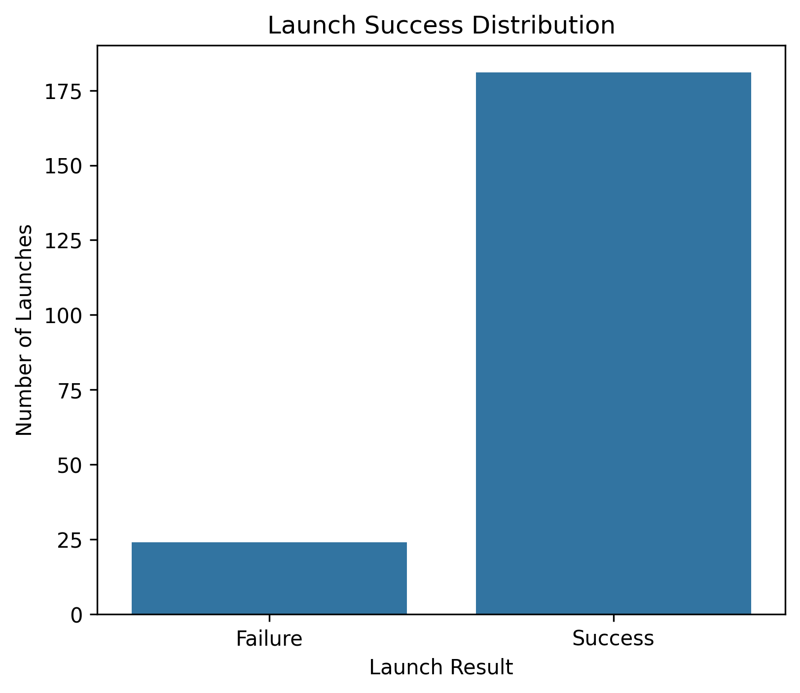 |
| Rocket Usage | 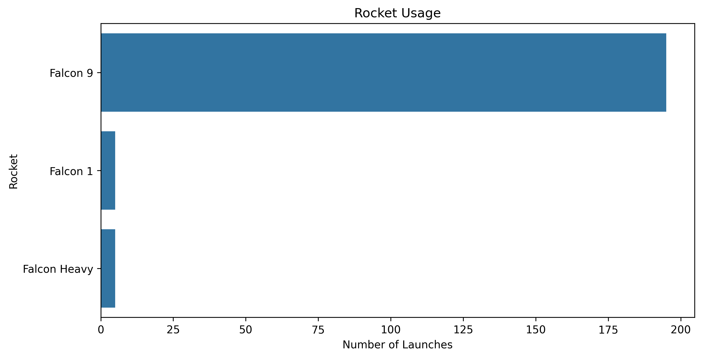 |
| Launchpad Usage | 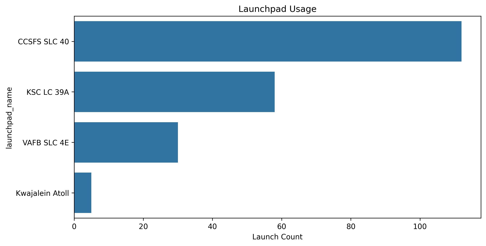 |
| Launches Per Year | 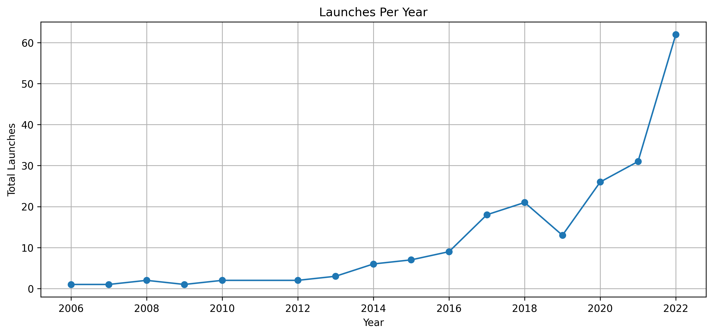 |
| Landing Success | 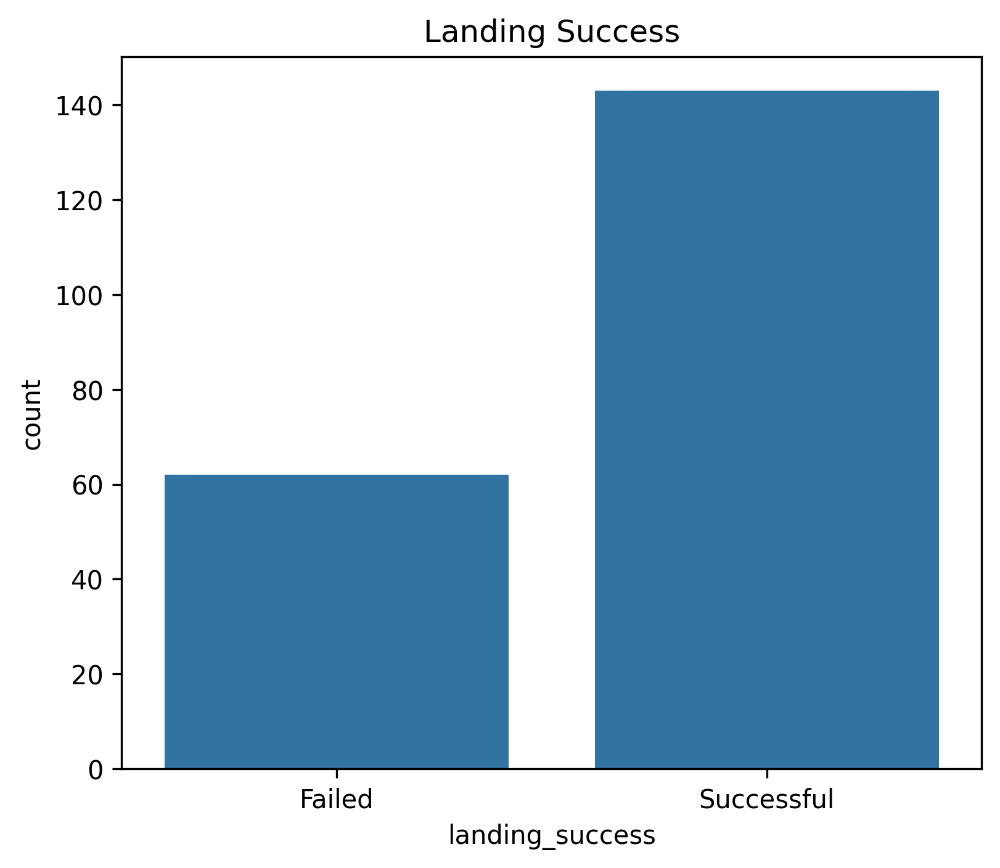 |
| Landing Type | 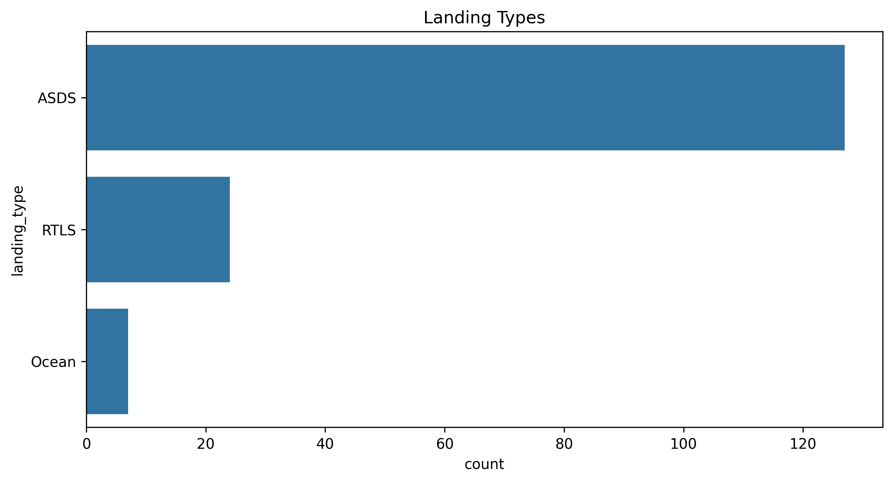 |
| Payload Distribution | 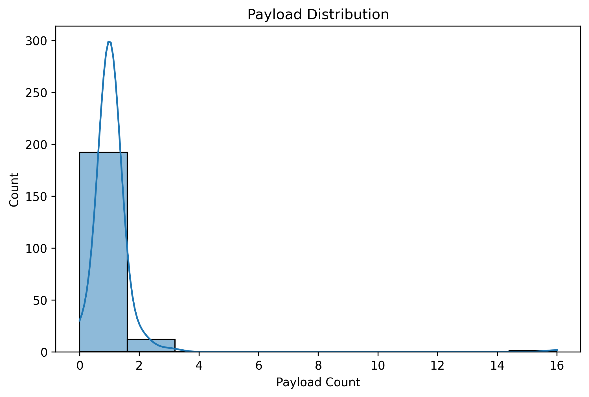 |
| Rocket Core Reuse | 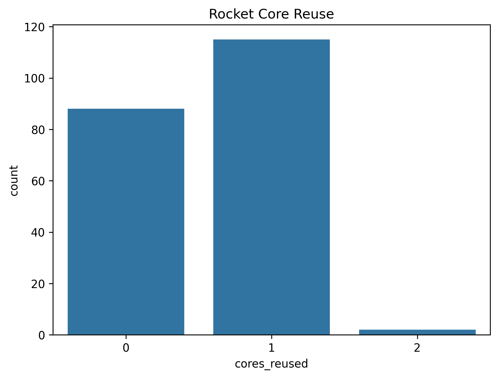 |
| Correlation Heatmap | 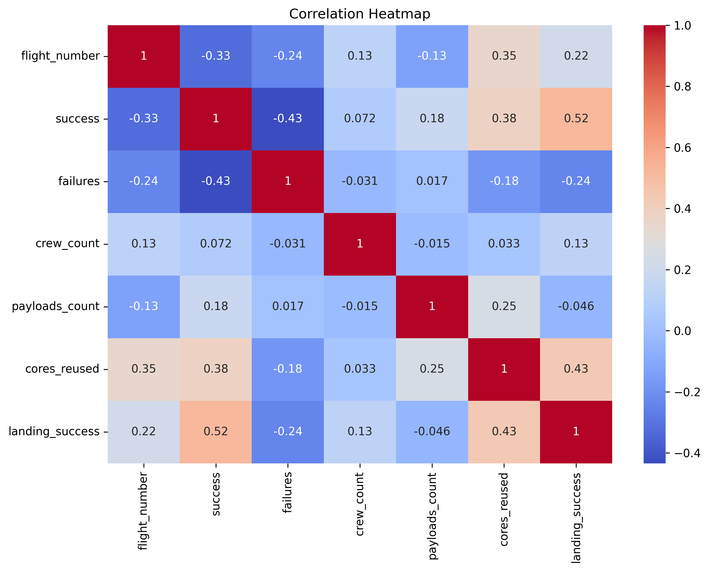 |
| Rocket Success Rate | 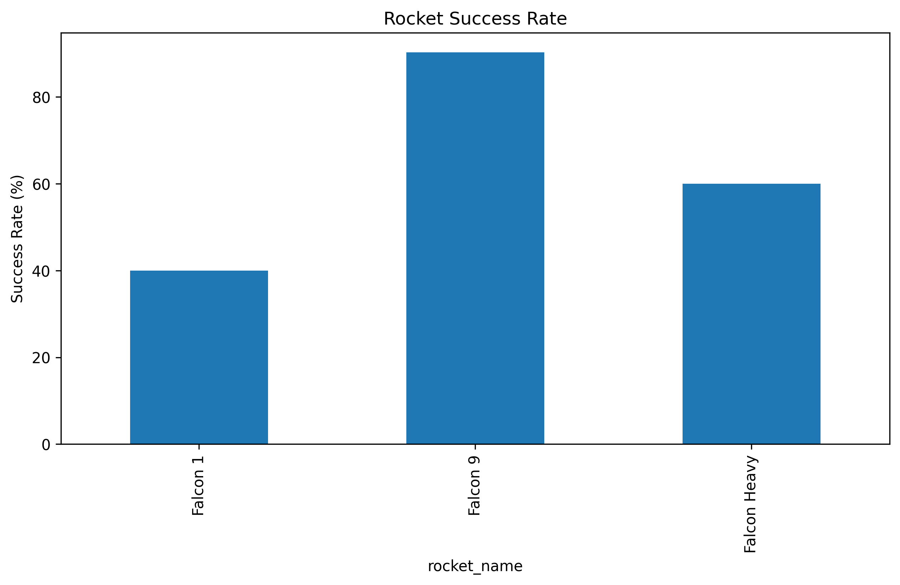 |
| Launchpad Success Rate | 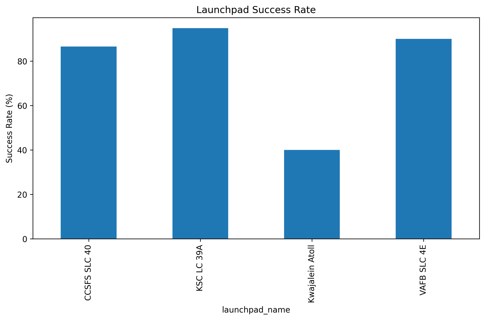 |
| Pairplot | 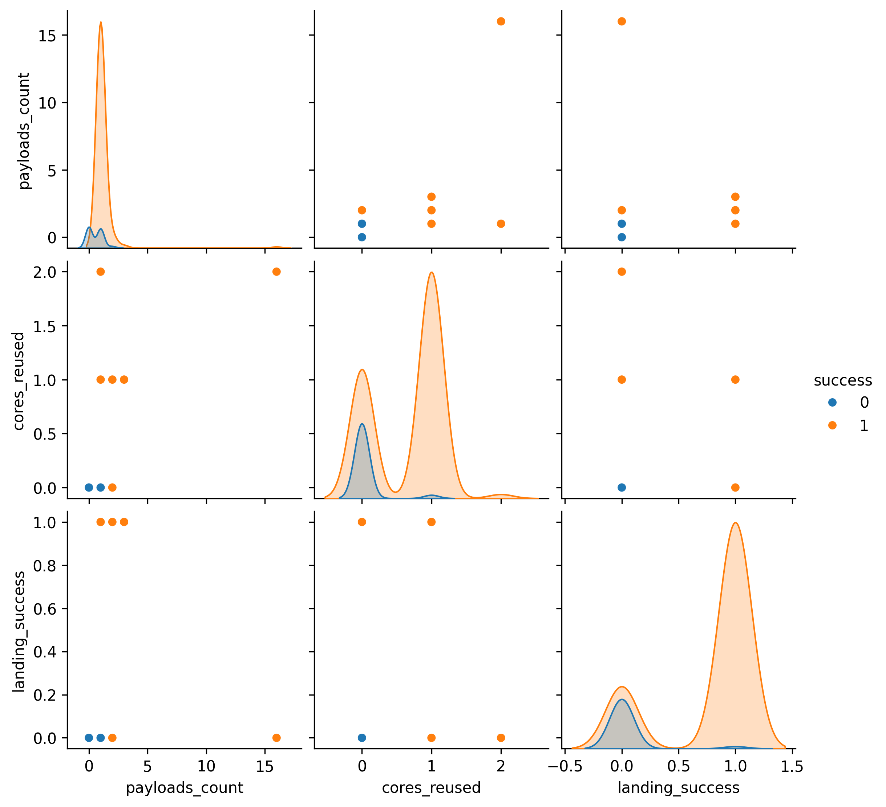 |

---

# 🧹 Data Preprocessing

The dataset was prepared using the following preprocessing techniques:

- ✔ Missing Value Handling
- ✔ Label Encoding
- ✔ Min-Max Feature Scaling
- ✔ Sequence Generation
- ✔ Train/Test Split

---

# 🤖 Deep Learning Models

## 🔹 Simple RNN

Simple RNN learns sequential information from previous inputs. It is computationally lightweight and suitable for basic sequence learning.

---

## 🔹 LSTM

LSTM introduces memory cells and gates that help retain long-term information, making it effective for learning complex sequential dependencies.

---

## 🔹 GRU

GRU is a simplified variant of LSTM with fewer parameters, allowing faster training while maintaining competitive performance.

---

# 📈 Model Performance

| Model | Test Accuracy |
|--------|--------------|
| 🧠 RNN | **52.5%** |
| 🧠 LSTM | **52.5%** |
| 🧠 GRU | **52.5%** |

---

# 🏆 Performance Analysis

All three Deep Learning models achieved the **same test accuracy of 52.5%**.

Although the training accuracy increased to approximately **98.75%**, the validation/test accuracy remained **52.5%**.

This indicates that the models learned the training data very well but struggled to generalize to unseen data, suggesting **overfitting**.

Since all three models produced identical evaluation scores, Python's `max()` function selected **RNN** as the best model because it appears first in the comparison dictionary.

**Therefore, RNN is not significantly better than LSTM or GRU in this experiment—all three models performed equally on the test dataset.**

---

# 📸 Project Results

## Training Accuracy


---

## Confusion Matrix

### RNN


### LSTM


### GRU


---

## Model Comparison


---

# 📁 Project Structure

```text
SpaceX-Launch-Prediction/
│
├── images/
│
├── spacex_launches.csv
│
├── spacex_prediction.py
│
├── README.md
│
└── requirements.txt
```

---

# 🔮 Future Improvements

- Improve feature engineering
- Hyperparameter tuning
- Reduce overfitting using Early Stopping
- Experiment with Bidirectional LSTM
- Test Transformer-based architectures
- Collect more launch records for better generalization

---

# 💡 Key Learning Outcomes

- Data preprocessing for Deep Learning
- Sequential data preparation
- Building RNN, LSTM and GRU models
- Model evaluation and comparison
- Detecting overfitting through training and validation performance
- End-to-end Deep Learning workflow using TensorFlow

---

# 👩‍💻 Author

## **Sana Shafique**

**BS Computer Science**

Deep Learning Project

---

<div align="center">

### ⭐ If you found this project helpful, please consider giving it a Star!

🚀 Thank you for visiting my project! 🚀

</div>