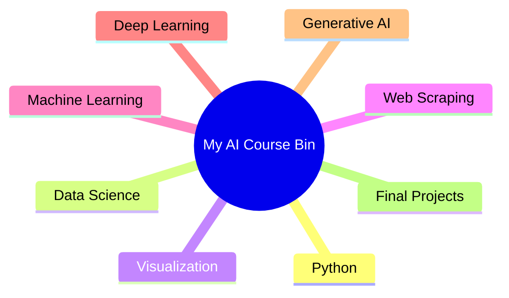
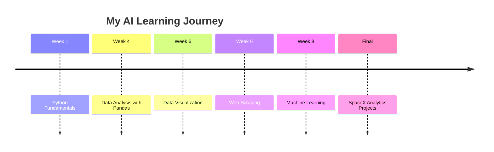
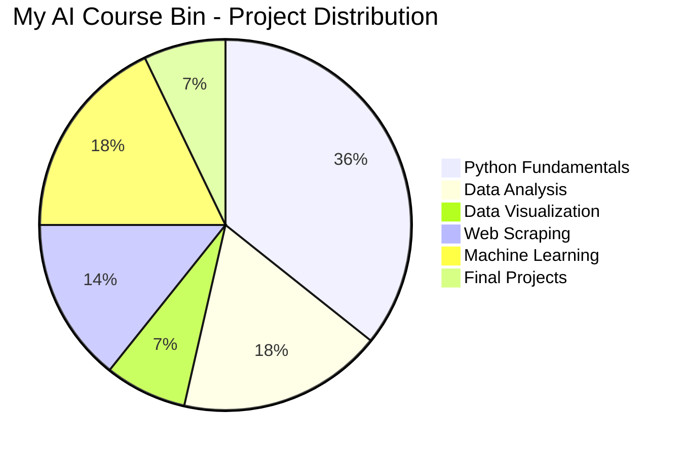

# 🚀🤖 My AI Course Bin – Full Stack Artificial Intelligence Journey

<div align="center">


<br>


### 🌟 From Python Fundamentals to Artificial Intelligence Projects 🌟

</div>

---

# 👩‍💻 About Me

Hi, I'm **Sana Shafique** 👋

🎓 BS Computer Science Student
🤖 AI & Machine Learning Enthusiast
💻 Full Stack Developer
📊 Data Science Learner
🚀 Passionate about solving real-world problems using Artificial Intelligence.

This repository represents my complete journey throughout the **Full Stack Artificial Intelligence Course**, where I explored Python programming, Data Science, Machine Learning, Deep Learning, Web Scraping, Generative AI, and Real-World Projects.

---

# 🎯 Course Objectives

This repository was created to:

✅ Document my learning journey.

✅ Practice programming and problem-solving skills.

✅ Build Machine Learning and AI projects.

✅ Work with real-world datasets.

✅ Learn data analysis and visualization.

✅ Explore Deep Learning and Generative AI.

✅ Build a strong AI portfolio on GitHub.

---

# 🛠️ Technologies & Tools

### Programming

* Python

### Libraries & Frameworks

* NumPy
* Pandas
* Matplotlib
* Seaborn
* Scikit-Learn
* TensorFlow
* Keras
* Selenium
* BeautifulSoup

### Tools

* Jupyter Notebook
* Google Colab
* VS Code
* Git & GitHub

---

# 📚 Course Modules

| Module                | Topics                                                           |
| --------------------- | ---------------------------------------------------------------- |
| 🐍 Python Programming | Variables, Lists, Tuples, Sets, Dictionaries, Strings, Functions |
| 📊 Data Science       | Data Cleaning, Data Analysis, Data Transformation                |
| 📈 Data Visualization | Matplotlib, Seaborn, Charts, Heatmaps                            |
| 🌐 Web Scraping       | BeautifulSoup, Selenium, Data Extraction                         |
| 🤖 Machine Learning   | Classification, Regression, Model Evaluation                     |
| 🧠 Deep Learning      | ANN, CNN, RNN, LSTM, GRU                                         |
| ✨ Generative AI       | Transformers, LLMs, RAG, Prompt Engineering                      |
| 🚀 Final Projects     | SpaceX Analytics and Real-World AI Projects                      |

---

# 📂 Repository Structure

```text id="tnccza"
My_AI_Course_Bin
│
├── 📁 Final Assessment
│   ├── 🚀 SpaceX Analytics (Task 1)
│   ├── 🚀 SpaceX Mission 2006 (Task 2)
│   ├── 🚀 SpaceX Stock Price Analysis (Task 3)
│   └── 🚀 Starlink & SpaceX Analysis (Task 4)
│
├── 📁 Week 1 – Python Fundamentals
│   ├── 40-Assignment-Question-For-PythonDS
│   ├── 40-Assignment-Question-IntermediateLevel
│   ├── Assignment_weekno1.py
│   ├── Case1.py
│   ├── Case2-import sys.py
│   ├── case3-HelloMe.py
│   ├── PracticeSectionDated13March2026.py
│   ├── StringAssignment.py
│   ├── part1.py → part5.py
│   ├── python.py
│   ├── string.py
│   └── string2.py
│
├── 📁 Week 4 – Data Analysis with Pandas
│   ├── FastFoodRestaurants Dataset
│   ├── Real Estate USA Dataset
│   ├── Real Estate Sales Dataset
│   ├── Startup Growth Investment Dataset
│   └── Data Analysis Projects
│
├── 📁 Week 6 – Data Visualization
│   ├── FastFoodRestaurant_saeborn.py
│   ├── RealEstaste_seaborn.py
│   ├── realestateSales2_seaborn.py
│   └── startup_growth_investment_seaborn.py
│
├── 📁 Week 6 – Web Scraping
│   ├── Amazon Scraping
│   ├── Alibaba Scraping
│   ├── Daraz Scraping
│   └── eBay Scraping
│
├── 📁 Week 8 – Machine Learning
│   ├── 📁 Classification
│   │   ├── Iris Classification
│   │   ├── Titanic Survival Prediction
│   │   ├── Heart Disease Prediction
│   │   ├── Cancer Prediction
│   │   └── Student Dropout Prediction
│   │
│   └── 📁 Regression
│       ├── Boston House Price Prediction
│       ├── Fish Weight Prediction
│       ├── Advertising Prediction
│       ├── Housing Prediction
│       └── Pakistan Social Media Usage Analysis
│
└── README.md
```

---

# 🐍 Python Fundamentals

### Skills Learned

✔ Variables and Data Types
✔ Lists, Tuples, Sets, Dictionaries
✔ Strings and Functions
✔ Problem Solving
✔ Python Assignments and Practice Exercises

---

# 📊 Data Analysis & Data Science

### Datasets Used

* Fast Food Restaurants Dataset
* Real Estate USA Dataset
* Real Estate Sales Dataset
* Startup Growth Investment Dataset

### Skills Learned

✔ Data Cleaning
✔ Exploratory Data Analysis (EDA)
✔ Statistical Analysis
✔ Data Transformation
✔ Working with CSV Files

---

# 📈 Data Visualization

### Libraries Used

* Matplotlib
* Seaborn

### Visualizations Created

✔ Bar Charts
✔ Pie Charts
✔ Histograms
✔ Heatmaps
✔ Correlation Analysis

---

# 🌐 Web Scraping

### Technologies

* BeautifulSoup
* Selenium

### Projects

✔ Amazon Product Scraper
✔ Alibaba Product Scraper
✔ Daraz Product Scraper
✔ eBay Product Scraper

---

# 🤖 Machine Learning

## Classification Projects

* Iris Flower Classification
* Titanic Survival Prediction
* Heart Disease Prediction
* Cancer Prediction
* Student Dropout Prediction

## Regression Projects

* Boston House Price Prediction
* Fish Weight Prediction
* Advertising Prediction
* Housing Prediction
* Pakistan Social Media Usage Analysis

---

# 🧠 Deep Learning & Generative AI

### Topics Covered

✔ Artificial Neural Networks (ANN)

✔ Convolutional Neural Networks (CNN)

✔ Recurrent Neural Networks (RNN)

✔ Long Short-Term Memory (LSTM)

✔ Gated Recurrent Units (GRU)

✔ Transformers

✔ Large Language Models (LLMs)

✔ Retrieval-Augmented Generation (RAG)

✔ Prompt Engineering

✔ TensorFlow & Keras Fundamentals

---

# 🚀 Final Assessment Projects

🛰️ SpaceX Analytics

🚀 SpaceX Mission 2006 Analysis

📈 SpaceX Stock Price Analysis

🌍 Starlink & SpaceX Growth Analysis

## 📊 Repository Overview



# 🏆 Skills Acquired

✅ Python Programming

✅ Data Science

✅ Data Analysis

✅ Data Visualization

✅ Web Scraping

✅ Machine Learning

✅ Deep Learning

✅ Generative AI

✅ Problem Solving

✅ Real-World Project Development

---
## 📈 Skills Progress

| Skill | Level |
|-------|--------|
| Python | ⭐⭐⭐⭐⭐ |
| Pandas | ⭐⭐⭐⭐⭐ |
| NumPy | ⭐⭐⭐⭐ |
| Data Visualization | ⭐⭐⭐⭐ |
| Machine Learning | ⭐⭐⭐⭐ |
| Deep Learning | ⭐⭐⭐ |
| Web Scraping | ⭐⭐⭐⭐ |
| Generative AI | ⭐⭐⭐ |

## 📊 Repository Statistics

- 📁 5+ Course Modules
- 📂 50+ Python Programs
- 🤖 10+ Machine Learning Projects
- 🌐 8+ Web Scraping Projects
- 📈 Multiple Data Visualization Projects
- 🚀 4 Final Assessment Projects
- 📚 Real World Datasets Used
# 👩‍💻 Author

## Sana Shafique

🎓 BS Computer Science Student

💻 Full Stack Developer

🤖 AI & Machine Learning Enthusiast

📊 Data Science Learner

🚀 Building intelligent systems and continuously learning new technologies.

---

<div align="center">

## ⭐ If you found this repository useful, please give it a Star ⭐


### 🚀 Made with ❤️ by Sana Shafique 🚀

</div>
